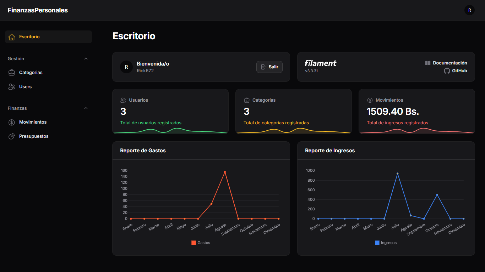
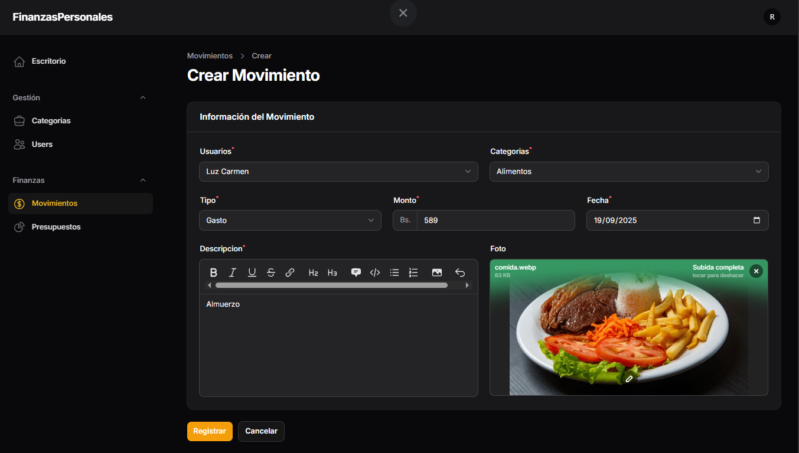

# 💰 Finanzas Personales

Sistema web para gestionar tus **ingresos y gastos personales**, desarrollado con **Laravel** y **Filament Admin Panel**.

---

## 🚀 Funcionalidades

- 📊 Dashboard con reportes de ingresos y gastos
- ✅ Registro y edición de movimientos financieros
- 📁 Categorías para organizar los gastos e ingresos
- 📅 Filtros por fechas, meses y años
- 📈 Gráficos interactivos usando Chart.js
- 👤 Gestión de usuarios
- 🔐 Autenticación segura integrada con Laravel

---

## 📸 Capturas de pantalla

### 1. Dashboard general con gráficos



_Visualiza los ingresos y gastos mensuales en un gráfico claro y dinámico._

---

### 2. Listado de movimientos


_Muestra todos tus movimientos financieros con opciones para filtrar y gestionar fácilmente._

---

### 3. Formulario para crear/editar movimientos



_Agrega o modifica ingresos y gastos con un formulario sencillo y completo._

---

## 🧰 Tecnologías utilizadas

- **Laravel 12+**
- **Filament v3** (admin panel)
- **Livewire**
- **Tailwind CSS**
- **Chart.js**
- **MySQL**

---

## 📦 Requisitos

- PHP ^8.1
- Composer
- Node.js & npm (opcional para assets personalizados)
- Base de datos (MySQL, PostgreSQL o SQLite)

---

## ⚙️ Instalación

```bash
# 1. Clona el repositorio
git clone https://github.com/rick672/Finanzas-Personales.git
cd finanzasPersonales

# 2. Instala dependencias
composer install

# 3. Copia archivo .env y configura base de datos
cp .env.example .env
# Edita .env con tus datos

# 4. Genera la clave de la app
php artisan key:generate

# 5. Ejecuta migraciones
php artisan migrate

# 6. (Opcional) Poblar datos iniciales
php artisan db:seed

# 7. Levanta el servidor
php artisan serve
